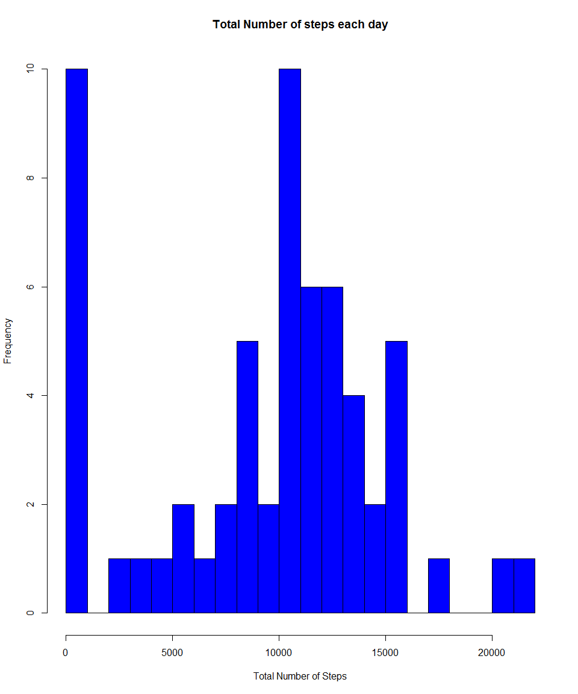
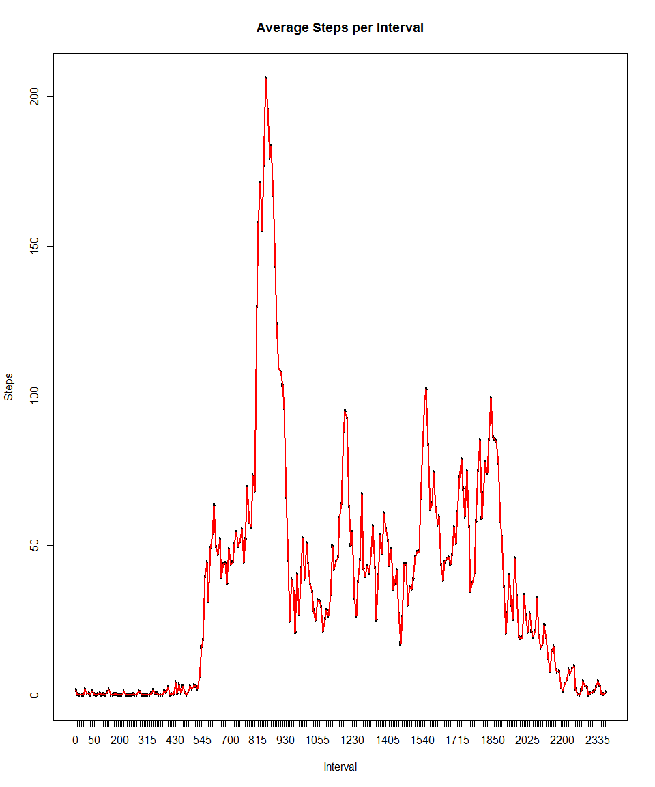
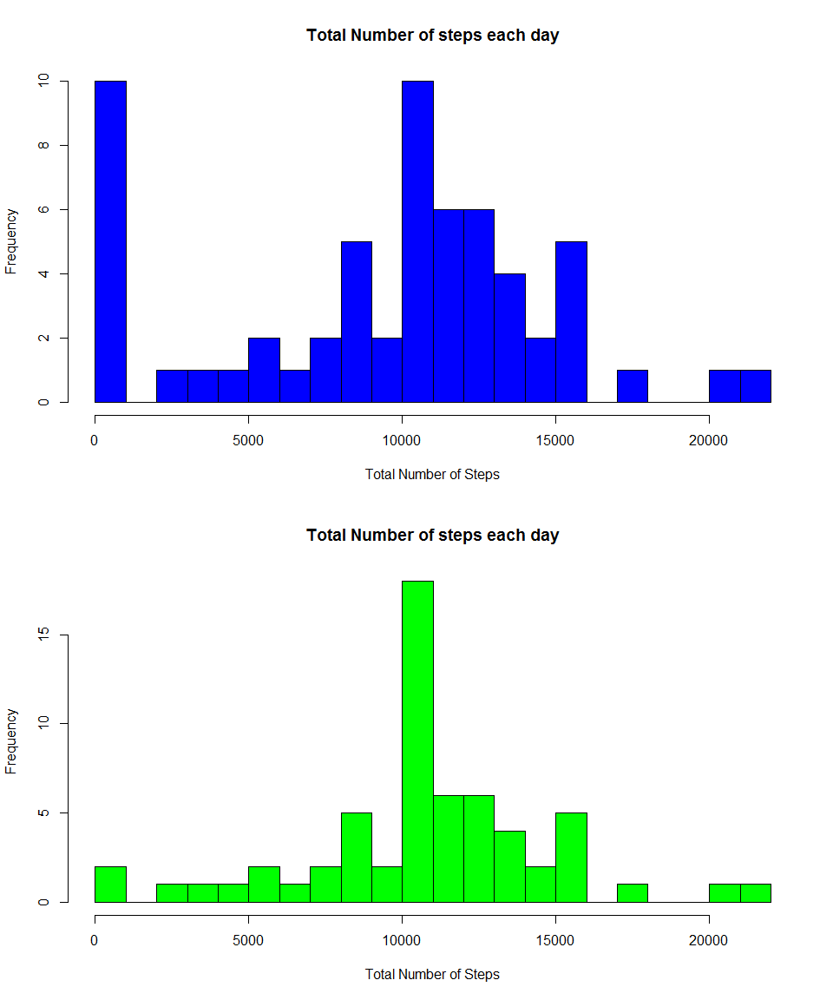
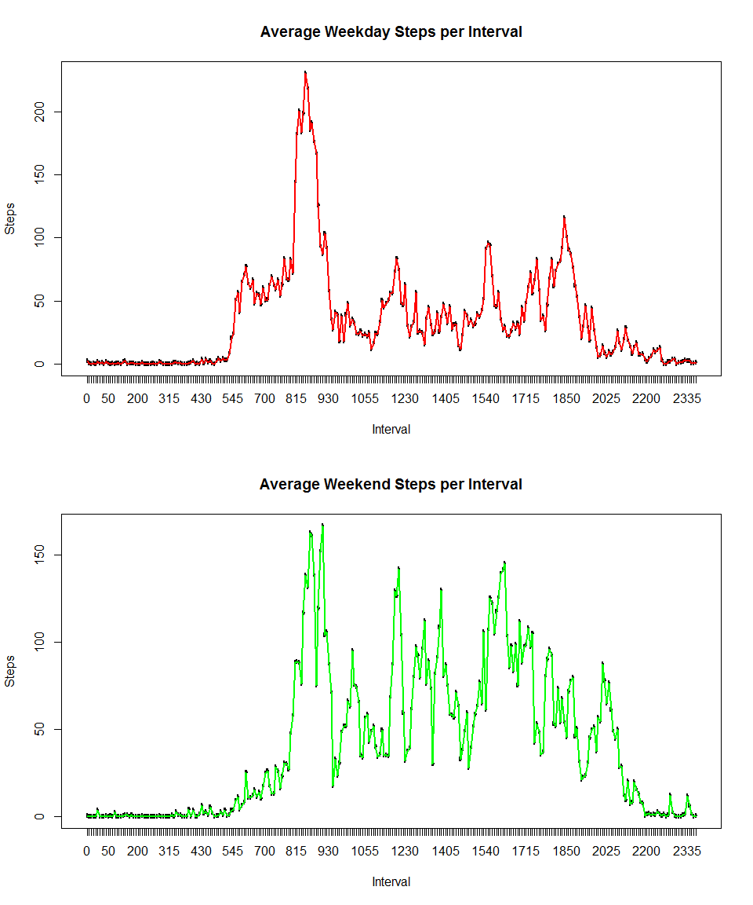

# Reproducible Research: Peer Assessment 1

## Loading and preprocessing the data

```r
## Set working directory
dir <- getwd()
if (!file.exists("ReproduceResearch")) {
        dir.create("ReproduceResearch")
}
setwd("./ReproduceResearch")

## Url and destination of the data
if (!exists("fileUrl")) {
fileUrl <- "https://d396qusza40orc.cloudfront.net/repdata%2Fdata%2Factivity.zip"
file <- file.path("activity.zip")
}

## Download and Unzip file
if (!file.exists(file)) {
        download.file(fileUrl, file)
        dateDownloaded <- Sys.time()
        unzip(file)
}

## Read data and create copy
if (!exists("activity")) {
        activity <- read.csv("activity.csv")
        activityCopy <- activity
        ## Just in case the original data gets screwed up
        ## activity <- activityCopy
}

## Convert date to date class
activity$date <- as.Date(activity$date, "%Y-%m-%d")

## Convert interval to a factor
activity$interval <- as.factor(activity$interval)

## Reset Working Directory
setwd(dir)
```


```r
## Suppress Warnings
oldw <- getOption("warn")
options(warn = -1)

## Save default plotting parameters
parameters <- par()
```

## What is mean total number of steps taken per day?

```r
## Use tapply function to find the total number of steps each day
totalSteps <- tapply(activity$steps, activity$date, sum, na.rm = TRUE)
```


```r
## Plot histogram of total steps each day
hist(totalSteps, breaks = 18, col = "blue", main = "Total Number of steps each day",
     xlab="Total Number of Steps")
```

<!-- -->

Days in which the total steps were less than 1000 are overrepresented due to missing data.


```r
## Calculate mean and median total steps each day
mean(totalSteps)
```

```
## [1] 9354.23
```

```r
median(totalSteps)
```

```
## [1] 10395
```

The mean average is 9354.23 steps. The median average is 10395 steps.

## What is the average daily activity pattern?

```r
## Use aggregate function to find the average number of steps per interval
intervalSteps <- aggregate(steps ~ interval, data = activity, mean, na.rm = TRUE)
```


```r
## Time series plot of average daily activity pattern
plot(intervalSteps, xlab = "Interval", ylab = "Steps", lwd = 2)
lines(intervalSteps, type = "l", col = "red", lwd = 2)
title(main = "Average Steps per Interval")
```

<!-- -->


```r
## Find interval with maximum average steps
intervalSteps[which.max(intervalSteps$steps),]
```

```
##     interval    steps
## 104      835 206.1698
```

The activity pattern shows a peak at approximately 8:30 in the morning.

## Imputing missing values

```r
# Missing data
missing <- is.na(activity)
sum(missing)
```

```
## [1] 2304
```

```r
## Replace missing data with average steps for corresponding interval
for (i in 1:length(activity$steps)) {
        if (is.na(activity[i, 1])) {
                
                ## Corresponding 5-minute interval, computed before
                stepaverage <- subset(intervalSteps, intervalSteps$interval == 
                                              activity[i,3])$steps
                
                ## Replace the value
                activity[i, 1] <- stepaverage
        } else {
                activity[i, 1] <- activity[i, 1]
        }
        activity
}

## Re-evaluate missing data
missing <- is.na(activity)
sum(missing)
```

```
## [1] 0
```

```r
## Use tapply function to recalculate total steps per day
totalSteps1 <- tapply(activity$steps, activity$date, sum, na.rm = TRUE)
```


```r
par(mfrow = c(2,1))

## Plot historgrams for original data and corrected data
hist(totalSteps, breaks = 18, col = "blue", main = "Total Number of steps each day",
     xlab="Total Number of Steps")
hist(totalSteps1, breaks = 18, col = "green", main = "Total Number of steps each day",
     xlab="Total Number of Steps")
```

<!-- -->

By replacing missing data with mean averages for the corresponding intervals, days with less than 1000 steps now only number 2. Meanwhile, there are now over 15 days with an average number of steps, approximately 10,000.


```r
## Calculate mean and median total steps each day
mean(totalSteps1)
```

```
## [1] 10766.19
```

```r
median(totalSteps1)
```

```
## [1] 10766.19
```

The new mean average is 10,766.19, as is the median average. Likely, there was day for which all data was missing.

## Are there differences in activity patterns between weekdays and weekends?

```r
## Add days variable to activity data
activity$days <- weekdays(activity$date)

## Create a logical vector d where days are Saturday or Sunday
d <- activity$days == "Saturday" | activity$days == "Sunday"

## Call Saturday and Sunday Weekend
activity$days[d] = "Weekend"
## Call weekdays (Monday through Friday) Weekdays
activity$days[!d] = "Weekday"

## Weekdays 
activityWD <- activity[activity$days == "Weekday",]
## Weekend
activityWE <- activity[activity$days == "Weekend",]

## Average number of steps during weekdays
avgWD <- aggregate(steps ~ interval, data = activityWD, mean, na.rm = TRUE)
## Average number of steps during the weekend
avgWE <- aggregate(steps ~ interval, data = activityWE, mean, na.rm = TRUE)
```


```r
## Save default plotting parameters
par(mfrow = c(2,1))

## Time series plot of average weekday activity pattern
plot(avgWD, xlab = "Interval", ylab = "Steps", lwd = 2)
lines(avgWD, type = "l", col = "red", lwd = 2)
title(main = "Average Weekday Steps per Interval")

## Time series plot of average weekday activity pattern
plot(avgWE, xlab = "Interval", ylab = "Steps", lwd = 2)
lines(avgWE, type = "l", col = "green", lwd = 2)
title(main = "Average Weekend Steps per Interval")
```

<!-- -->


```r
avgWD[which.max(avgWD$steps),]
```

```
##     interval    steps
## 104      835 230.3782
```

```r
avgWE[which.max(avgWE$steps),]
```

```
##     interval    steps
## 112      915 166.6392
```

The maximum average number of steps during weekdays is higher than the weekend, but there seems to be more activity in general during the weekend. However, on both weekdays and weekends, the peak activity takes place between 8:30 and 9:30 in the morning. 


```r
## Reset Warning Options
options(warn = oldw)

## Reset default plotting parameters
par(parameters)
```

```
## Warning in par(parameters): graphical parameter "cin" cannot be set
```

```
## Warning in par(parameters): graphical parameter "cra" cannot be set
```

```
## Warning in par(parameters): graphical parameter "csi" cannot be set
```

```
## Warning in par(parameters): graphical parameter "cxy" cannot be set
```

```
## Warning in par(parameters): graphical parameter "din" cannot be set
```

```
## Warning in par(parameters): graphical parameter "page" cannot be set
```
